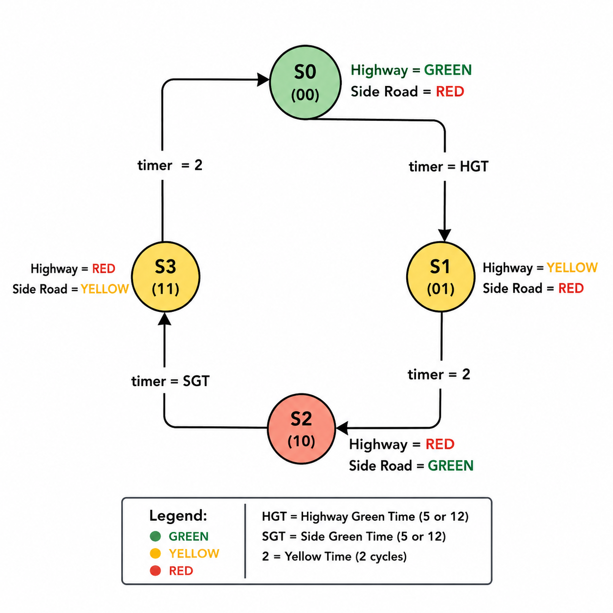
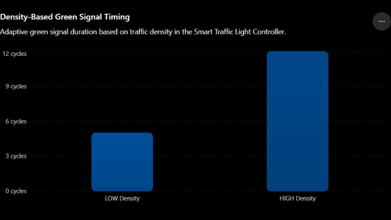
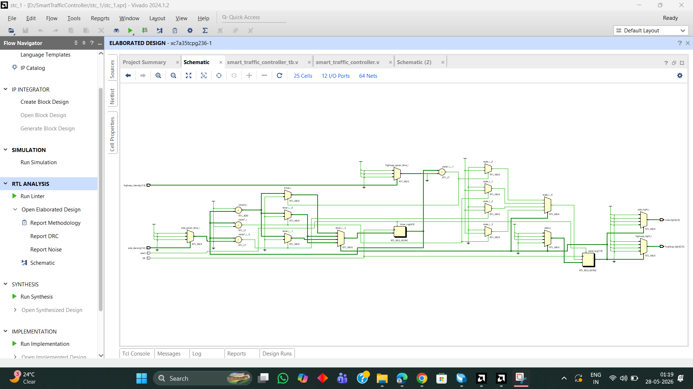
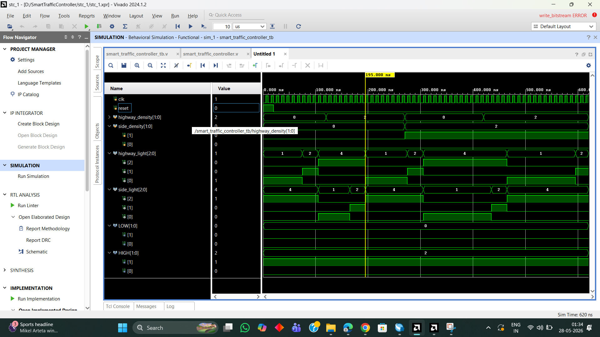

Smart Traffic Light Controller

Smart Traffic Light Controller using Verilog HDL

Introduction

Traffic congestion is one of the major problems in modern cities due to the increasing number of vehicles and inefficient traffic management systems. Conventional traffic signal systems use fixed timing allocation irrespective of actual traffic density, resulting in unnecessary waiting time, traffic jams, fuel consumption, and delays.

This project presents a Smart Traffic Light Controller using Verilog HDL based on Moore Finite State Machine (FSM) architecture. The controller dynamically adjusts the GREEN signal timing according to traffic density conditions.

The hardware design was implemented and verified using Xilinx Vivado 2024.1 FPGA design suite.

This project is suitable for:

FPGA Learning

VLSI Mini Projects

Verilog HDL Practice

Project Features

Moore FSM Based Design

Density-Based Adaptive Traffic Control

Dynamic GREEN Signal Timing

LOW- and High-Density Detection

Verilog RTL Design

Behavioural Simulation

RTL Schematic Generation

FPGA Synthesis and Implementation

Vivado Simulation Verification

FSM State Diagram

 

FSM Lookup Table

Traffic Signal Encoding

Methodology

The traffic controller operates using a Moore FSM consisting of four states.

The controller continuously monitors traffic density inputs:

00 → LOW Density

10 → HIGH Density

The GREEN signal timing dynamically changes according to traffic conditions.

LOW Density

When traffic density is LOW:

GREEN signal remains active for 5 cycles

HIGH Density

When traffic density is HIGH:

GREEN signal remains active for 12 cycles

This adaptive timing mechanism reduces unnecessary waiting time and improves traffic flow efficiency.

Traffic Density Logic

Verilog RTL Design

The RTL design includes:

FSM state transition logic

Smart timing control logic

Traffic light output generation

Density-based timing allocation

Testbench Verification

A Verilog testbench was developed to verify:

FSM transitions

Reset operation

LOW density timing

HIGH density timing

Traffic signal outputs

Output Waveforms

Behavioral simulation was successfully verified in Vivado.

The waveform confirms:

Proper FSM transitions

Correct traffic signal sequencing

Dynamic GREEN signal timing adjustment

LOW Density Result

GREEN signal duration = 5 cycles

HIGH Density Result

GREEN signal duration = 12 cycles

RTL Schematic View

The RTL schematic generated in Vivado confirms:

FSM hardware structure

Multiplexer logic

Timer logic

Output signal generation

FPGA Synthesis and Implementation

The design was synthesized and implemented successfully using Xilinx Vivado.

Implementation verifies:

FPGA resource utilization

Timing analysis

Synthesizable RTL logic

Hardware-ready design flow

Tools Used

Verilog HDL

Xilinx Vivado 2024.1

Moore FSM Design

FPGA RTL Simulation

RTL Schematic Analysis

Result

The Smart Traffic Light Controller successfully demonstrated:

Moore FSM operation

Adaptive traffic management

Density-based timing allocation

Behavioral simulation

FPGA synthesis and implementation

The project effectively reduces unnecessary waiting time by dynamically adjusting GREEN signal timing based on traffic density conditions.

Future Work

This project can be further enhanced using Artificial Intelligence and FPGA-based smart systems.

Future improvements include:

AI-Based Traffic Prediction

Emergency Vehicle Detection

Pedestrian Crossing System

Camera-Based Vehicle Detection

IoT Smart Traffic Monitoring

Multi-Road Traffic Management

Real-Time Traffic Optimization using FPGA + AI

Edge AI Traffic Analytics

Smart City Integration

In future versions, AI algorithms can be integrated with FPGA hardware accelerators for real-time adaptive traffic optimization.

Conclusion

The Smart Traffic Light Controller using Verilog HDL demonstrates a practical FPGA-based adaptive traffic management system using Moore FSM architecture.

The project successfully integrates:

FSM Design

Smart Timing Logic

FPGA Verification

Hardware-Oriented Design Methodology

This project provides a strong foundation for future AI-integrated smart traffic management systems using FPGA technology.

Author

 Muttu Manahalli
